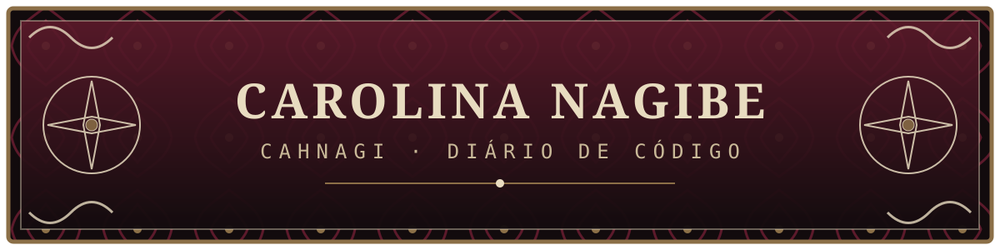
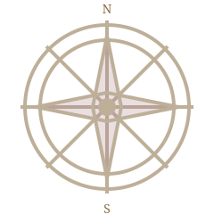
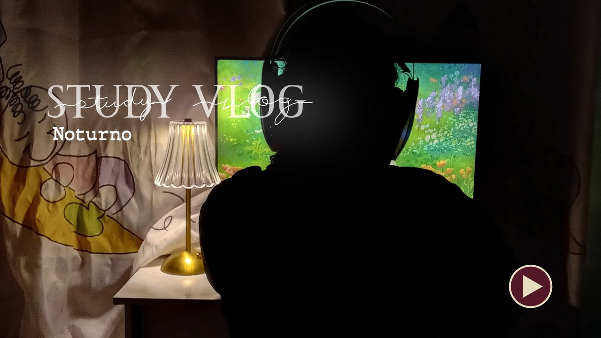
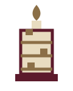
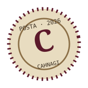
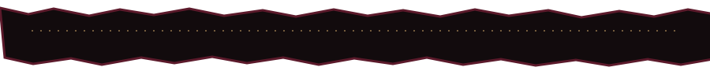

  

  

  <a href="#sobre-mim">Sobre mim</a> ·
  <a href="#grimório-de-skills">Skills</a> ·
  <a href="#diário-em-vídeo">Vídeos</a> ·
  <a href="#estatísticas-do-diário">Estatísticas</a> ·
  <a href="#conecte-se-comigo">Contato</a>

 

  

## Sobre mim

  

> **C**omecei esta jornada entre linhas de código, cadernos de anotações e mapas de possibilidades. Sou **Carolina Nagibe**, mas pode me chamar de **Carol** — estudante de Engenharia de Computação e desenvolvedora em formação, construindo meu próximo capítulo na tecnologia.

1. **Formação:** Engenharia de Computação na **UNIVESP**, com formação técnica em Desenvolvimento de Sistemas pela **ETEC**.
2. **Próxima expedição:** em busca de uma oportunidade de **estágio ou vaga júnior em TI**, onde eu possa aprender, colaborar e transformar problemas em soluções.
3. **Estudando agora:** Ruby e Programação Orientada a Objetos, Python e desenvolvimento web.
4. **Aprendendo em público:** no canal **Carol Tech** eu mostro o processo real, com os erros incluídos — *"te ensinando a fazer errado"*.

  

## Grimório de Skills

  

### Linguagens

![C#](https://img.shields.io/badge/C%23-5c1a2b?style=for-the-badge&logo=data:image/svg+xml;base64,PHN2ZyB4bWxucz0iaHR0cDovL3d3dy53My5vcmcvMjAwMC9zdmciIHZpZXdCb3g9IjAgMCAxMjggMTI4Ij48cGF0aCBmaWxsPSIjZThkY2MwIiBkPSJNMTE1LjQgMzAuN0w2Ny4xIDIuOWMtLjgtLjUtMS45LS43LTMuMS0uNy0xLjIgMC0yLjMuMy0zLjEuN2wtNDggMjcuOWMtMS43IDEtMi45IDMuNS0yLjkgNS40djU1LjdjMCAxLjEuMiAyLjQgMSAzLjVsMTA2LjgtNjJjLS42LTEuMi0xLjUtMi4xLTIuNC0yLjd6Ii8%2BPHBhdGggZmlsbD0iI2U4ZGNjMCIgZD0iTTEwLjcgOTUuM2MuNS44IDEuMiAxLjUgMS45IDEuOWw0OC4yIDI3LjljLjguNSAxLjkuNyAzLjEuNyAxLjIgMCAyLjMtLjMgMy4xLS43bDQ4LTI3LjljMS43LTEgMi45LTMuNSAyLjktNS40VjM2LjFjMC0uOS0uMS0xLjktLjYtMi44bC0xMDYuNiA2MnoiLz48cGF0aCBmaWxsPSIjNWMxYTJiIiBkPSJNODUuMyA3Ni4xQzgxLjEgODMuNSA3My4xIDg4LjUgNjQgODguNWMtMTMuNSAwLTI0LjUtMTEtMjQuNS0yNC41czExLTI0LjUgMjQuNS0yNC41YzkuMSAwIDE3LjEgNSAyMS4zIDEyLjVsMTMtNy41Yy02LjgtMTEuOS0xOS42LTIwLTM0LjMtMjAtMjEuOCAwLTM5LjUgMTcuNy0zOS41IDM5LjVzMTcuNyAzOS41IDM5LjUgMzkuNWMxNC42IDAgMjcuNC04IDM0LjItMTkuOGwtMTIuOS03LjZ6TTk3IDY2LjJsLjktNC4zaC00LjJ2LTQuN2g1LjFMMTAwIDUxaDQuOWwtMS4yIDYuMWgzLjhsMS4yLTYuMWg0LjhsLTEuMiA2LjFoMi40djQuN2gtMy4zbC0uOSA0LjNoNC4ydjQuN2gtNS4xbC0xLjIgNmgtNC45bDEuMi02aC0zLjhsLTEuMiA2aC00LjhsMS4yLTZoLTIuNHYtNC43SDk3em00LjggMGgzLjhsLjktNC4zaC0zLjhsLS45IDQuM3oiLz48L3N2Zz4%3D)
![C++](https://img.shields.io/badge/C%2B%2B-5c1a2b?style=for-the-badge&logo=data:image/svg+xml;base64,PHN2ZyB4bWxucz0iaHR0cDovL3d3dy53My5vcmcvMjAwMC9zdmciIHZpZXdCb3g9IjAgMCAyNCAyNCI%2BPHBhdGggZmlsbD0iI2U4ZGNjMCIgZD0iTTIyLjM5NCA2Yy0uMTY3LS4yOS0uMzk4LS41NDMtLjY1Mi0uNjlMMTIuOTI2LjIyYy0uNTA5LS4yOTQtMS4zNC0uMjk0LTEuODQ4IDBMMi4yNiA1LjMxYy0uNTA4LjI5My0uOTIzIDEuMDEzLS45MjMgMS42djEwLjE4YzAgLjI5NC4xMDQuNjIuMjcxLjkxLjE2Ny4yOS4zOTguNTQzLjY1Mi42OWw4LjgxNiA1LjA5Yy41MDguMjkzIDEuMzQuMjkzIDEuODQ4IDBsOC44MTYtNS4wOWMuMjU0LS4xNDcuNDg1LS40LjY1Mi0uNjkuMTY3LS4yOS4yNy0uNjE2LjI3LS45MVY2LjkxYy4wMDMtLjI5NC0uMS0uNjItLjI2OC0uOTF6TTEyIDE5LjExYy0zLjkyIDAtNy4xMDktMy4xOS03LjEwOS03LjExIDAtMy45MiAzLjE5LTcuMTEgNy4xMS03LjExYTcuMTMzIDcuMTMzIDAgMDE2LjE1NiAzLjU1M2wtMy4wNzYgMS43OGEzLjU2NyAzLjU2NyAwIDAwLTMuMDgtMS43OEEzLjU2IDMuNTYgMCAwMDguNDQ0IDEyIDMuNTYgMy41NiAwIDAwMTIgMTUuNTU1YTMuNTcgMy41NyAwIDAwMy4wOC0xLjc3OGwzLjA3OCAxLjc4QTcuMTM1IDcuMTM1IDAgMDExMiAxOS4xMXptNy4xMS02LjcxNWgtLjc5di43OWgtLjc5di0uNzloLS43OXYtLjc5aC43OXYtLjc5aC43OXYuNzloLjc5em0yLjk2MiAwaC0uNzl2Ljc5aC0uNzl2LS43OWgtLjc5di0uNzloLjc5di0uNzloLjc5di43OWguNzl6Ii8%2BPC9zdmc%2B)

### Web

### Dados

### Ferramentas

### Em estudo

  

## Diário em vídeo

  <em>Estudos, erros e bastidores do canal <strong>Carol Tech</strong>.</em>

<b>Study Vlogs</b>

 

  
    
  <b>Study Vlog Noturno</b> 
  Acompanhe uma sessão de estudos à noite comigo.  
  <a href="https://youtu.be/C3xCREirgtE">Assistir no YouTube →</a>

  

 

  

## Estatísticas do diário

  
  

  

## Update Log

  

| Data | Registro do diário |
|---|---|
| `2026.09` | Publiquei o **Study Vlog Noturno** no canal Carol Tech. |
| `2026.09` | Comecei o curso de Ruby e POO e criei o repositório [`estudos-ruby`](https://github.com/cahnagi/estudos-ruby) para guardar as práticas. |
| `2026.09` | Novo visual do perfil: um diário gótico com bússola, pergaminho e renda. |

  

## Conecte-se comigo

  
    
  
  
  

 

  
   
  <i>“Toda boa solução começa com uma pergunta — e toda jornada, com o primeiro commit.”</i>

